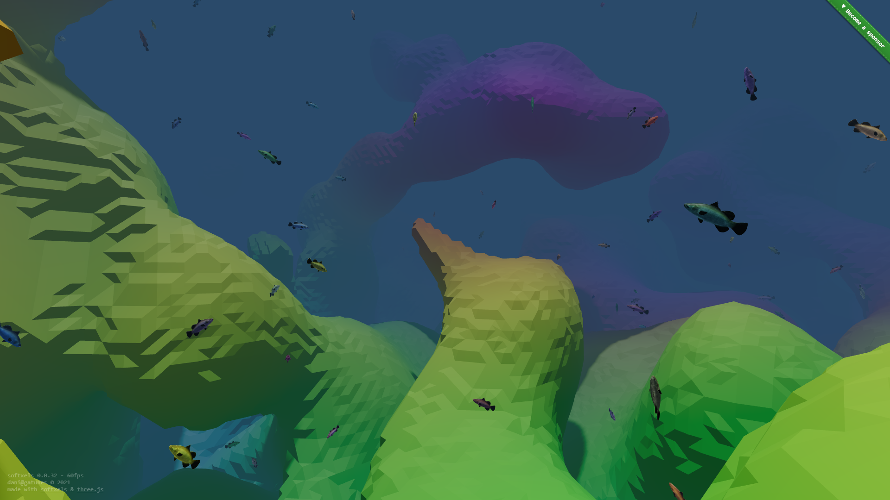

[softxels](https://softxels.gatunes.com/)
[](https://www.npmjs.com/package/softxels)
==

[](https://softxels.gatunes.com/)

### Examples

* Editable world:
  * Demo (default worldgen): [https://softxels.gatunes.com/](https://softxels.gatunes.com/)
  * Demo (terrain worldgen): [https://softxels.gatunes.com/#/terrain](https://softxels.gatunes.com/#/terrain)
  * Source: [example/main.js](example/main.js)

* VR sculpting:
  * Demo [https://softxels-xr.glitch.me/](https://softxels-xr.glitch.me/)
  * Source: [https://glitch.com/edit/#!/softxels-xr](https://glitch.com/edit/#!/softxels-xr)

* Random walkers:
  * Demo: [https://softxels-walker.glitch.me/](https://softxels-walker.glitch.me/)
  * Source: [https://glitch.com/edit/#!/softxels-walker](https://glitch.com/edit/#!/softxels-walker)

### Installation

```bash
npm install softxels
```

### Basic usage

```js
import World from 'softxels';
import { PerspectiveCamera, Scene, WebGLRenderer } from 'three';

const aspect = window.innerWidth / window.innerHeight;
const camera = new PerspectiveCamera(70, aspect, 0.1, 1000);
const renderer = new WebGLRenderer({ antialias: true });
renderer.setSize(window.innerWidth, window.innerHeight);

const scene = new Scene();
const world = new World();
scene.add(world);

renderer.setAnimationLoop(() => {
  world.updateChunks(camera.position);
  renderer.render(scene, camera);
});
```

### World constructor
```js
new World({
  chunkMaterial: MeshBasicMaterial({ // A ThreeJS Material instance to render all chunks (default: null)
    vertexColors: true,
  }),
  chunkSize: 32, // An uInt8 that controls the data/render chunks size (default: 32)
  renderRadius: 5, // Controls the chunk radius updateChunks loads around the anchor (default: 5)
  seed: 1337, // A uInt32 seed to drive the world generation noise (default: Random)
  worldgen: 'default', // 'default', 'terrain' or 'empty'
});
```

### updateChunks
```js
// This will load all the chunks around the anchor in the selected renderRadius
// passed to the constructor.
// It will also unload all the render chunks further away (renderRadius * 1.25).
// You should call this everytime you move the anchor.
// It does remember the last chunk the anchor was in, so... It will only
// update when the anchor crosses a chunk boundary.
const anchor = new Vector3(1, 2, 3);
world.updateChunks(anchor);
```

### updateVolume
```js
world.updateVolume(
  new Vector3(1, 2, 3), // A point in worldspace
  2, // A uInt8 radius to update around the point
  0xFF, // A uInt8 scalar where: 
        // 0 === OUTSIDE
        // 0X80 === AT ISOSURFACE
        // 0xFF === INSIDE
  { r: 0x11, g: 0x22, b: 0x33 } // An optional 24bit RGB color
);
```

### Modifying the WASM programs

To build the C code, you'll need to install LLVM:

 * Win: [https://chocolatey.org/packages/llvm](https://chocolatey.org/packages/llvm)
 * Mac: [https://formulae.brew.sh/formula/llvm](https://formulae.brew.sh/formula/llvm)
 * Linux: [https://releases.llvm.org/download.html](https://releases.llvm.org/download.html)

On the first build, it will complain about a missing file that you can get here:
[libclang_rt.builtins-wasm32-wasi-12.0.tar.gz](https://github.com/WebAssembly/wasi-sdk/releases/download/wasi-sdk-12/libclang_rt.builtins-wasm32-wasi-12.0.tar.gz). Just put it on the same path that the error specifies and you should be good to go.

To build [wasi-libc](https://github.com/WebAssembly/wasi-libc), you'll need to install [GNU make](https://chocolatey.org/packages/make)

```bash
# clone this repo and it's submodules
git clone --recursive https://github.com/danielesteban/softxels.git
cd softxels
# build wasi-libc
cd vendor/wasi-libc && make -j8 && cd ../..
# install dev dependencies
npm install
# start the dev environment:
npm start
# open http://localhost:8080/ in your browser
```
